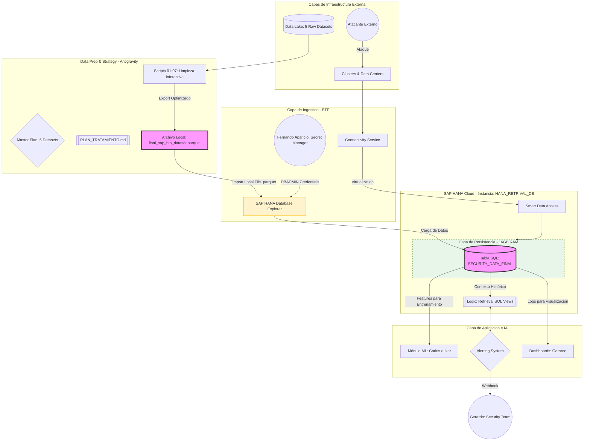

```mermaid
graph TD
    %% Capa 0: Estrategia y Prep (Tu trabajo actual)
    subgraph Layer_0 [Data Prep & Strategy - Antigravity]
        MasterPlan{Master Plan: 5 Datasets}
        Plan[[PLAN_TRATAMIENTO.md]]
        Cleaning[Scripts 01-07: Limpieza Interactiva]
        Local[Archivo Local: final_sap_btp_dataset.parquet]
    end

    %% Capa 1: Origen Externo
    subgraph Layer_1 [Capas de Infraestructura Externa]
        Attacker((Atacante Externo)) -- "Ataque" --> Clusters[Clusters & Data Centers]
        DataLake[(Data Lake: 5 Raw Datasets)]
    end

    %% Capa 2: Ingestión y Seguridad (Tu Rol de Integration)
    subgraph Layer_2 [Capa de Ingestion - BTP]
        Connectivity[Connectivity Service]
        DB_Explorer[SAP HANA Database Explorer]
        SM((Fernando Aparicio: Secret Manager))
    end

    %% Capa 3: Persistencia (El Corazón en SAP)
    subgraph Layer_3 [SAP HANA Cloud - Instancia: HANA_RETRIVAL_DB]
        SDA[Smart Data Access]
        
        subgraph Storage_Layer [Capa de Persistencia - 16GB RAM]
            Table[(Tabla SQL: SECURITY_DATA_FINAL)]
        end
        
        Retrieval[[Logic: Retrieval SQL Views]]
    end

    %% Capa 4: Inteligencia y Salida (Consumidores)
    subgraph Layer_4 [Capa de Aplicacion e IA]
        ML[Módulo ML: Carlos e Iker]
        Alerts{Alerting System}
        Dash[Dashboards: Gerardo]
    end

    %% --- FLUJO INTEGRADO DEL DATO ---
    
    %% Del Data Lake a tu limpieza
    DataLake --> Cleaning
    Cleaning -->|Export Optimizado| Local
    
    %% De tu compu a la nube (Paso crítico que vas a validar)
    Local -- "Import Local File .parquet" --> DB_Explorer
    SM -.->|DBADMIN Credentials| DB_Explorer
    DB_Explorer -- "Carga de Datos" --> Table
    
    %% Conexiones de Infraestructura
    Clusters --> Connectivity
    Connectivity -->|Virtualization| SDA
    SDA --> Storage_Layer
    
    %% Uso de los datos cargados
    Table -->|Features para Entrenamiento| ML
    Table -->|Contexto Histórico| Retrieval
    Table -->|Logs para Visualización| Dash
    
    Retrieval <--> Alerts
    Alerts -->|Webhook| Security((Gerardo: Security Team))

    %% Estilos de Resalte
    style Local fill:#f9f,stroke:#333,stroke-width:3px
    style Table fill:#f9f,stroke:#333,stroke-width:3px
    style DB_Explorer fill:#fff3cd,stroke:#ffc107,stroke-width:2px
    style Storage_Layer fill:#e8f5e9,stroke:#2e7d32,stroke-dasharray: 5 5
```
